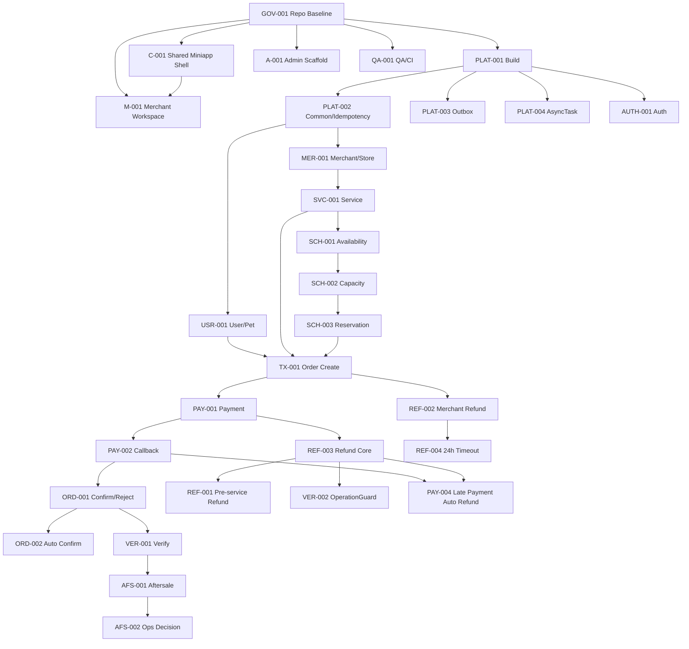

# Dependency Graph

前端 C/M/Admin 基于 Contract/Mock 可与后端并行，不要求等待所有后端节点完成。

## Wave2执行/完成附加门禁（不改原图的历史依赖）

- PLAT002公共ID/Clock固定片段 → PLAT004启动；不要求幂等整项DONE才可试验Worker，但禁止重复公共实现。
- CCR-W2-IDEMP → PLAT002幂等实现；CCR-W0-001 → PLAT003实现。
- CCR-ACR/PERM → AUTH真实实现/SDK；AUTH规范阶段自身可先起草。
- CCR-W2-API对应域 → USR/MER/SVC和业务页面契约；PLAT003 → MER真实下线事件。
- C002完整真实验收 → AUTH+USR；C003真实查询 → MER+SVC+SCH001/002；M002真实范围 → AUTH+MER+SVC+SCH及签约；A002真实治理 → ADM001+AUTH。

这些后置业务依赖不被强行拉入本波。批准Contract Mock可独立推进中间阶段，仍不等于完整Issue的E2E完成。C002与C003同Role/同目录串行，AUTH与USR的pet-user、PLAT003/004/AUTH的pet-boot按文件独占交接。

PLAT-004公共交接补充：接口与明确测试替身固定可开始开发，但完整生产Worker交付必须采用PLAT-002实际Snowflake提供器和Clock装配并验证；不以空接口判DoD，也无需等公共幂等整项DONE。
