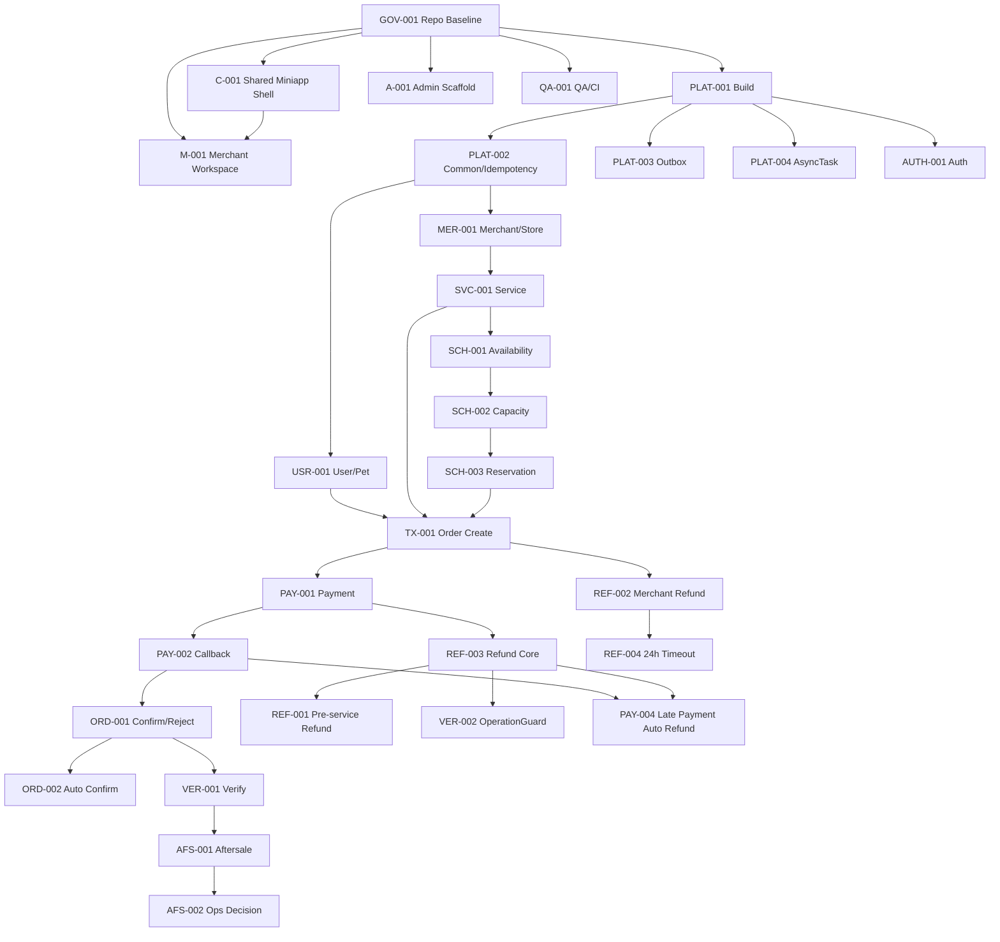

# Dependency Graph

```mermaid
flowchart TD
  GOV[GOV-001 Repo Baseline] --> PLAT[PLAT-001 Build]
  GOV --> C1[C-001 Shared Miniapp Shell]
  GOV --> M1[M-001 Merchant Workspace]
  C1 --> M1
  GOV --> A1[A-001 Admin Scaffold]
  GOV --> QA1[QA-001 QA/CI]

  PLAT --> COMMON[PLAT-002 Common/Idempotency]
  PLAT --> OUTBOX[PLAT-003 Outbox]
  PLAT --> TASK[PLAT-004 AsyncTask]
  PLAT --> AUTH[AUTH-001 Auth]

  COMMON --> USER[USR-001 User/Pet]
  COMMON --> MER[MER-001 Merchant/Store]
  MER --> SVC[SVC-001 Service]
  SVC --> SCH1[SCH-001 Availability]
  SCH1 --> SCH2[SCH-002 Capacity]
  SCH2 --> SCH3[SCH-003 Reservation]

  USER --> ORD[TX-001 Order Create]
  SVC --> ORD
  SCH3 --> ORD

  ORD --> PAY1[PAY-001 Payment]
  PAY1 --> PAY2[PAY-002 Callback]
  PAY1 --> REF3[REF-003 Refund Core]
  PAY2 --> CONF[ORD-001 Confirm/Reject]
  CONF --> AUTO[ORD-002 Auto Confirm]
  CONF --> VER[VER-001 Verify]

  ORD --> REF2[REF-002 Merchant Refund]
  REF3 --> REFB[REF-001 Pre-service Refund]
  REF2 --> REFT[REF-004 24h Timeout]
  REF3 --> GUARD[VER-002 OperationGuard]
  VER --> AFS[AFS-001 Aftersale]
  AFS --> AFSD[AFS-002 Ops Decision]

  PAY2 --> LATE[PAY-004 Late Payment Auto Refund]
  REF3 --> LATE
```

前端 C/M/Admin 基于 Contract/Mock 可与后端并行，不要求等待所有后端节点完成。
