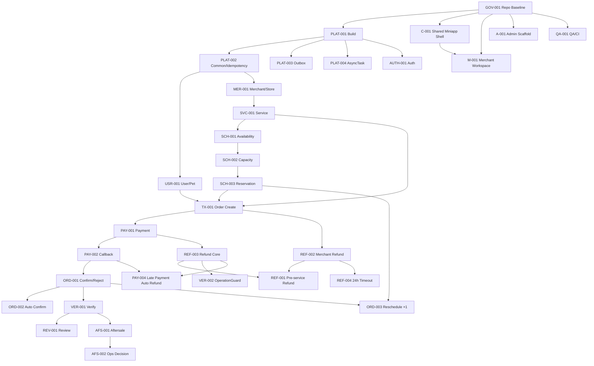

# Dependency Graph

```mermaid
flowchart TD
  GOV[GOV-001 Repo Baseline] --> PLAT[PLAT-001 Build]
  GOV --> C1[C-001 Shared Miniapp Shell]
  GOV --> M1[M-001 Merchant Workspace]
  C1 --> M1
  GOV --> A1[A-001 Admin Scaffold]
  GOV --> QA1[QA-001 QA/CI]

  PLAT --> COMMON[PLAT-002 Common/Idempotency]
  PLAT --> OUTBOX[PLAT-003 Outbox]
  PLAT --> TASK[PLAT-004 AsyncTask]
  PLAT --> AUTH[AUTH-001 Auth]

  COMMON --> USER[USR-001 User/Pet]
  COMMON --> MER[MER-001 Merchant/Store]
  MER --> SVC[SVC-001 Service]
  SVC --> SCH1[SCH-001 Availability]
  SCH1 --> SCH2[SCH-002 Capacity]
  SCH2 --> SCH3[SCH-003 Reservation]

  USER --> ORD[TX-001 Order Create]
  SVC --> ORD
  SCH3 --> ORD

  ORD --> PAY1[PAY-001 Payment]
  PAY1 --> PAY2[PAY-002 Callback]
  PAY1 --> REF3[REF-003 Refund Core]
  PAY2 --> CONF[ORD-001 Confirm/Reject]
  CONF --> AUTO[ORD-002 Auto Confirm]
  CONF --> VER[VER-001 Verify]
  CONF --> RES[ORD-003 Reschedule ×1]
  SCH3 --> RES
  VER --> REV[REV-001 Review]

  ORD --> REF2[REF-002 Merchant Refund]
  REF3 --> REFB[REF-001 Pre-service Refund]
  REF2 --> REFB
  REF2 --> REFT[REF-004 24h Timeout]
  REF3 --> GUARD[VER-002 OperationGuard]
  VER --> AFS[AFS-001 Aftersale]
  AFS --> AFSD[AFS-002 Ops Decision]

  PAY2 --> LATE[PAY-004 Late Payment Auto Refund]
  REF3 --> LATE
```

前端 C/M/Admin 基于 Contract/Mock 可与后端并行，不要求等待所有后端节点完成。

REF-001 已按 2026-10-05 用户裁决随 PR #103 交付（分支 codex/ref001-auto-refund-20261002，默认关闭）：除原图 REF-003 外，实现另复用普通退款申请机制（契约49，ISSUE 目录 REF-002 切片：apply/决定/建单恢复/核销互斥），退款单来源为专门的服务前标记 PRESTART_AUTO（不复用 MERCHANT_TIMEOUT_AUTO）；因此上图补 REF2 → REFB 边。

## Wave2执行/完成附加门禁（不改原图的历史依赖）

- PLAT002公共ID/Clock固定片段 → PLAT004启动；不要求幂等整项DONE才可试验Worker，但禁止重复公共实现。
- CCR-W2-IDEMP → PLAT002幂等实现；CCR-W0-001 → PLAT003实现。
- CCR-ACR/PERM → AUTH真实实现/SDK；AUTH规范阶段自身可先起草。
- CCR-W2-API对应域 → USR/MER/SVC和业务页面契约；PLAT003 → MER真实下线事件。
- C002完整真实验收 → AUTH+USR；C003真实查询 → MER+SVC+SCH001/002；M002真实范围 → AUTH+MER+SVC+SCH及签约；A002真实治理 → ADM001+AUTH。

这些后置业务依赖不被强行拉入本波。批准Contract Mock可独立推进中间阶段，仍不等于完整Issue的E2E完成。C002与C003同Role/同目录串行，AUTH与USR的pet-user、PLAT003/004/AUTH的pet-boot按文件独占交接。

PLAT-004公共交接补充：接口与明确测试替身固定可开始开发，但完整生产Worker交付必须采用PLAT-002实际Snowflake提供器和Clock装配并验证；不以空接口判DoD，也无需等公共幂等整项DONE。

## 2026-10-10 目录重核注记

依赖结构自 2026-10-05 REF-001 注记后无实质变化：PR#126~#141 均为既有 Issue 范围内的切片交付（消费既有契约面或补齐既有 HTTP 面/页面），未新增 Issue 级依赖边，未撤销任何边。本次仅补画两处已交付但原图缺失的节点：

- `ORD-003 Reschedule ×1`：依赖 ORD-001（商家确认命令基础）与 SCH-003（预约生命周期/claim 交换），依 46号契约与 ISSUE_CATALOG 既有 Dependencies 列；HTTP 面与 C 端页面已由 PR#132 交付（内核 2026-09-29 批交付）。
- `REV-001 Review`：依赖 VER-001（核销事实决定评价资格），依 ISSUE_CATALOG 既有 Dependencies 列；已由 PR#134 交付（资格判定单真源在 ORDER 域，review-biz 依赖 order-api）。

节点交付状态（DONE/IN_PROGRESS/BLOCKED）不在本图维护，以 [ISSUE_CATALOG](ISSUE_CATALOG.csv) 为准（已重核至 2026-10-10）。QA-005 现状如实登记：核心交易闭环模拟器 E2E 一轮已全链通过（PR#133），运营Web主链 E2E 与二轮验收未做，故 IN_PROGRESS。
